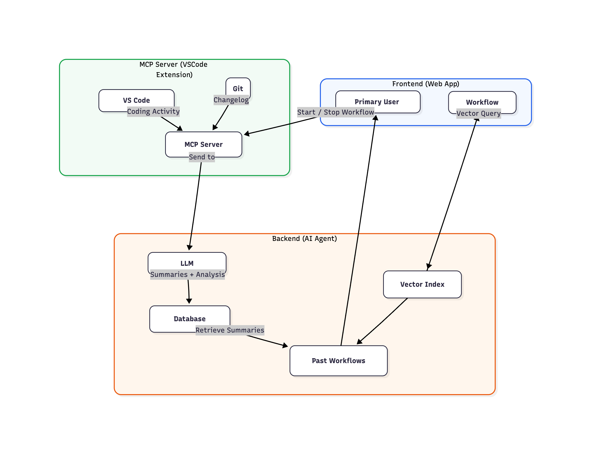

# Working Memory
>_1st Place Grand Prize at HackUTD 2025_\
>_Website: https://workingmemory.vip_\
>_Devpost: https://devpost.com/software/working-memory_

_Working Memory_ is an agentic workflow that passively observes your coding sessions, summarizes your progress, and reconstructs context from your history, enabling seamless re-entry into any project.

## How It Works
1. **Start a session:** Initialize a coding session directly within the web dashboard.
2. **Code as usual:** Any modified or newly created files are tracked.
3. **Stop the session:** The changelog is gathered and fed into an AI data-processing pipeline, producing:
   - A natural-language summary containing a high-level overview and actionable insights.
   - Structured metadata containing the ```git status``` output.
4. **View History:** The results appear in the web dashboard under Past Workflows, complete with a search engine for re-entering context later.

## Architecture
### Frontend UI
- Built with TypeScript, React, and Tailwind CSS.
- Employs elegant glassmorphism UI components (GlassCard, Pill) and minimalist design.
- Handles session creation, workflow history, and theme preferences.
- Implements vector search for instant retrieval of past sessions.

### Model Context Protocol (MCP) Server
- Built with TypeScript in the form of a VS Code extension.
- Exposes an HTTP endpoint to return the active project path.

### Backend Agent
- Built with Python, FastAPI, and GitPython.
- Calls MCP server to retrieve active project path
- Scans the file tree and structures the changelog
- Feeds changelog into GPT-4.1 mini (fast, general-purpose reasoning model with large context window)


